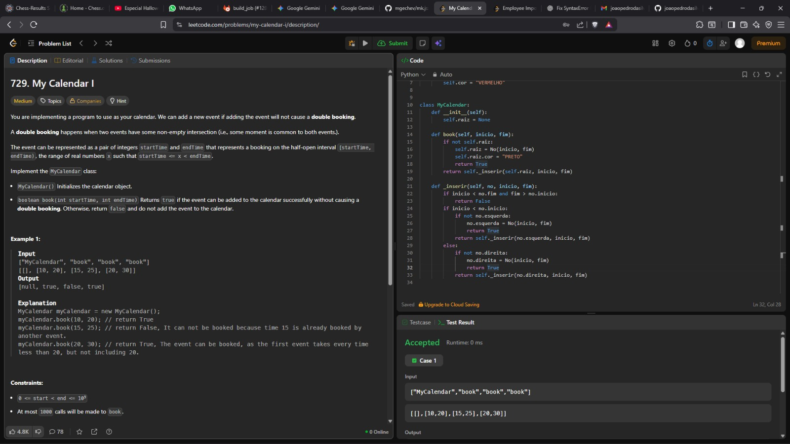
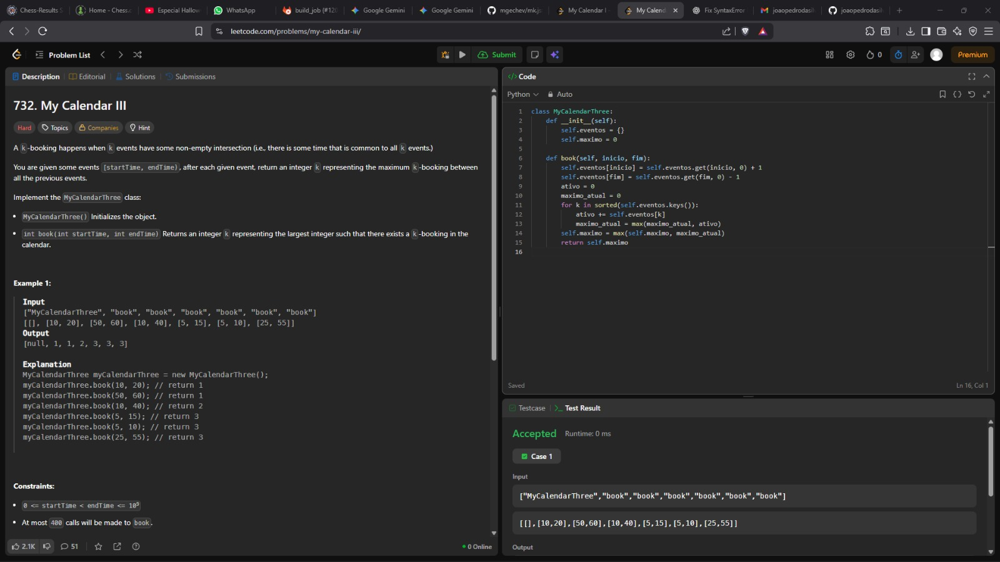
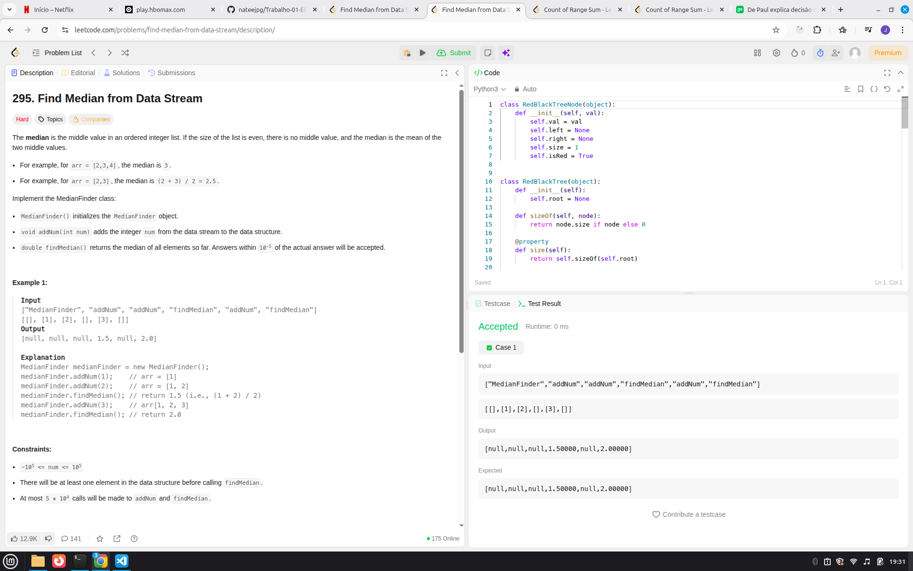
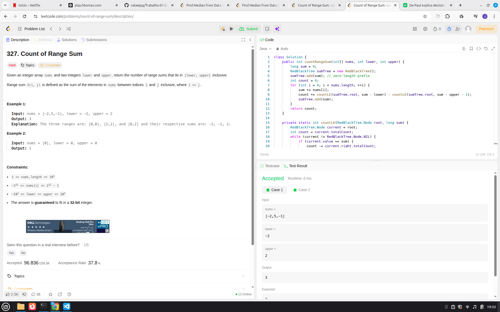

# Algorítmos de busca!

**Número da Lista**: 31<br>
**Conteúdo da Disciplina**: Árvores Balanceadas!<br>

## Alunos
|Matrícula | Aluno |
| -- | -- |
| 211031074 | João Pedro da Silva Rodrigues |
| 221022696 | Nathan Benigno Ponce de Abreu |

## Sobre 

### Questões
| Título | Responsável | Dificuldade
| -- | -- | -- | 
| 729. My Calendar I | Nathan Abreu | Média |
| 732. My Calendar III  | Nathan Abreu | Difícil |
| 295. Find Median from Data Stream | João Pedro | Díficil |
| 327. Count of Range Sum | João Pedro | Díficil |


## Screenshots
### [(729. My Calendar I)](https://leetcode.com/problems/my-calendar-i/description/)



### [ (732. My Calendar III)](https://leetcode.com/problems/my-calendar-iii/description/)




### [(295. Find Median from Data Stream)](https://leetcode.com/problems/find-median-from-data-stream/description/)



### [(327. Count of Range Sum)](https://leetcode.com/problems/count-of-range-sum/description/)

 


## Link do vídeo

Clique no link abaixo para ser direcionado para o vídeo: 

[(Link do Vídeo)](https://youtu.be/xPs1782cfR8)  


## Guia de execução

### Questão 01

rode o Python: Nathan/729.py

```
input: 
["MyCalendar", "book", "book", "book"]
[[], [10, 20], [15, 25], [20, 30]]

output: 
[null, true, false, true]

```

### Questão 02

rode o Python: Nathan/732.py

```
input: 
["MyCalendarThree","book","book","book","book","book","book"]
[[],[10,20],[50,60],[10,40],[5,15],[5,10],[25,55]]

output:
[null,1,1,2,3,3,3]

```

### Questão 295. Find Median from Data Stream

rode o Python: Joao_Pedro/295.py

```
Input
["MedianFinder", "addNum", "addNum", "findMedian", "addNum", "findMedian"]
[[], [1], [2], [], [3], []]
Output
[null, null, null, 1.5, null, 2.0]


```

### Questão 327. Count of Range Sum

rode o Python: Joao_Pedro/327.py

```
Input: nums = [-2,5,-1], lower = -2, upper = 2
Output: 3
Explanation: The three ranges are: [0,0], [2,2], and [0,2] and their respective sums are: -2, -1, 2.

```

## Instalação 
python instalado

**Linguagem**: Python <br>
